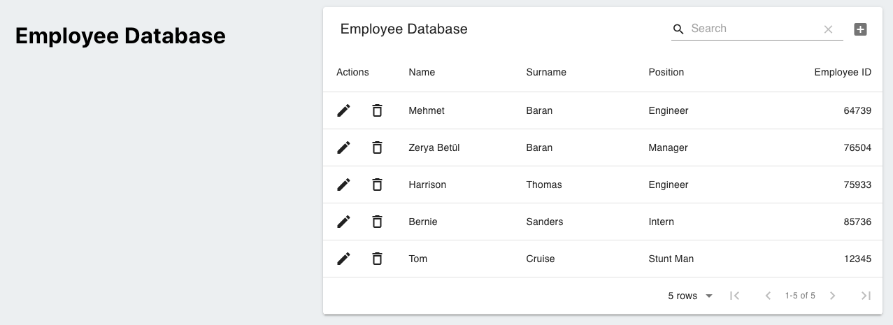
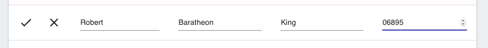
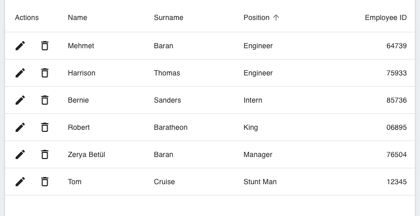

## Employee Directory
### A React App Using Materialize-UI
Link to the deployed app:
https://employee-directory-93.herokuapp.com/

## User Story
AS AN HR director,
I WANT TO view all of the company's employees in a sortable table,
SO THAT I have easy and organized access to our the company's employee pool.

## How It Works

Currently, there are five employees that are hard-coded into the database. The user has the option to add additional employees by clicking the plus sign in the upper right hand corner.

Then, the user can sort the employees by the categories listed. For example, we can sort by their role by clicking on the "Position" category.

If we choose to delete an employee, the user can click the garbage can icon, and then will be prompted with a delete verification.
